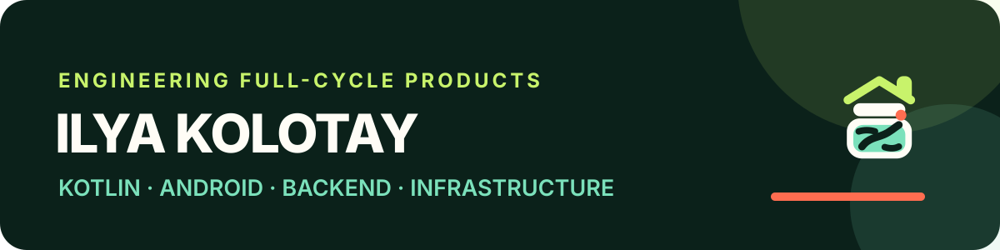

  

  <a href="https://zapasli.sokolkolotaj.ru/">Zapasli</a> ·
  <a href="https://github.com/sokolkolotay/zapasli-android">Android</a> ·
  <a href="https://github.com/sokolkolotay/zapasli-backend">Backend</a> ·
  <a href="https://github.com/sokolkolotay/zapasli-web">Web</a> ·
  <a href="https://api.zapasli.sokolkolotaj.ru/swagger">API Docs</a>

## Обо мне

С 2021 года работаю в IT в компании «ЦФТ». Прошёл путь от инженера по прикладному сопровождению до ведущего инженера. С 2026 года работаю инженером по автоматизации и параллельно развиваюсь как Android/Kotlin-разработчик.

Мне интересно создавать продукт целиком: от мобильного интерфейса и API до контейнеризации, CI/CD и production-развёртывания. Мой инженерный фокус — **Kotlin, Android, backend и инфраструктура**. В проектах ценю понятную архитектуру, автоматические проверки, безопасность и документацию, по которой систему сможет запустить другой разработчик.

## Zapasli — флагманский проект

<table>
  <tr>
    <td width="18%" align="center">
      
    </td>
    <td width="82%">
      <h3>Zapasli · семейный учёт домашних продуктов</h3>
      
Full-stack дипломный продукт: Android-приложение, собственный backend и продуктовый сайт. Zapasli помогает учитывать продукты, сроки годности, места хранения, штрихкоды и КБЖУ.

      

        <a href="https://zapasli.sokolkolotaj.ru/"><strong>Открыть сайт</strong></a> ·
        <a href="https://github.com/sokolkolotay/zapasli-android/releases/latest"><strong>Скачать APK</strong></a> ·
        <a href="https://api.zapasli.sokolkolotaj.ru/swagger"><strong>Swagger / OpenAPI</strong></a>
      

    </td>
  </tr>
</table>

<table>
  <tr>
    <td width="33%" valign="top">
      <h3>01 · Android</h3>
      
Offline-first приложение на Kotlin и Jetpack Compose: Room, Retrofit, Coroutines, Hilt, CameraX и ML Kit.

      
RU/EN · светлая/тёмная тема · unit/UI tests · GitHub Actions

      <a href="https://github.com/sokolkolotay/zapasli-android"><strong>zapasli-android →</strong></a>
    </td>
    <td width="33%" valign="top">
      <h3>02 · Backend</h3>
      
Production API на Kotlin/Ktor с PostgreSQL, Flyway, защищёнными сессиями и полной OpenAPI-схемой.

      
Docker Compose · health checks · HTTPS · автоматические тесты

      <a href="https://github.com/sokolkolotay/zapasli-backend"><strong>zapasli-backend →</strong></a>
    </td>
    <td width="33%" valign="top">
      <h3>03 · Product Web</h3>
      
Адаптивный сайт продукта с живым preview реальных экранов приложения и прямой загрузкой APK.

      
Semantic HTML · responsive CSS · Caddy · Docker · CI

      <a href="https://github.com/sokolkolotay/zapasli-web"><strong>zapasli-web →</strong></a>
    </td>
  </tr>
</table>

## Обучение

<table>
  <tr>
    <td width="28%" align="center">
      <a href="https://netology.ru/">
        <picture>
          <source media="(prefers-color-scheme: dark)" srcset="https://static.tildacdn.com/tild3865-3364-4862-b631-373063623366/FULL_logo_white.svg">
          <source media="(prefers-color-scheme: light)" srcset="https://static.tildacdn.com/tild3965-3531-4235-b330-633633363065/full_1.svg">
          
        </picture>
      </a>
    </td>
    <td width="72%">
      <h3>Android-разработчик с нуля</h3>
      
<strong>Нетология · 2024–2026</strong>

      
Kotlin, Java, Android SDK, архитектура приложений, работа с сетью и локальными данными, тестирование и командный Git workflow. Итоговая работа — экосистема Zapasli.

    </td>
  </tr>
</table>

## Технологии

  
  
  
  
  
  
  
  
  
  
  

## Другие проекты

- [Back-Server](https://github.com/sokolkolotay/Back-Server) — Ktor API на VPS: PostgreSQL, Docker Compose, Kafka, observability и CI/CD.
- [tg-bot](https://github.com/sokolkolotay/tg-bot) — Telegram-бот на Kotlin с Kafka producer и развёртыванием в k3s.
- [back-server-k8s](https://github.com/sokolkolotay/back-server-k8s) — Helm charts для Kubernetes-инфраструктуры backend-стека.
- [Notes-Android](https://github.com/sokolkolotay/Notes-Android) — Android-клиент на Kotlin, Retrofit, Coroutines и MVVM для собственного API.

---

  <strong>Инженерия полного цикла: приложение → API → инфраструктура → production.</strong>

